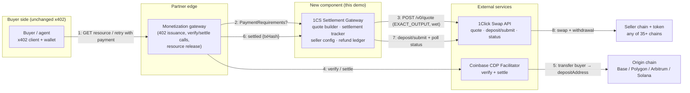
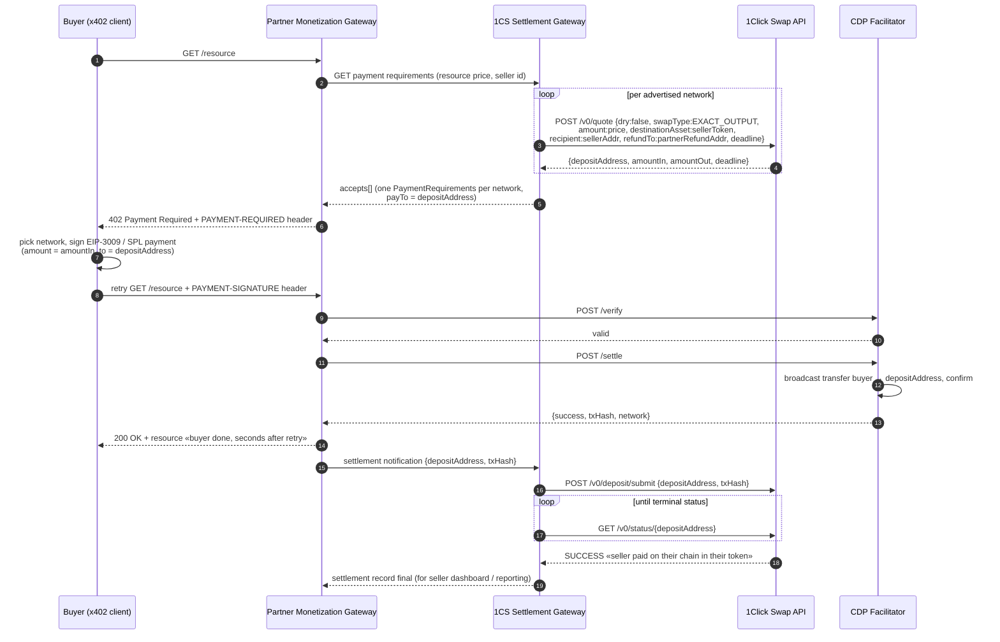

# Monetization Gateway × NEAR Intents 1Click — Demo Design

**Status:** Draft for review · **Date:** 2026-09-01 · **Audience:** integration partner engineering, NEAR Intents engineering

A lightweight demo showing how a Cloudflares's x402 monetization gateway can offer sellers **automatic settlement on any of 35+ chains and 180+ tokens** while buyers keep paying stablecoins over standard x402 on any [Coinbase CDP facilitator network](https://docs.cdp.coinbase.com/x402/seller/facilitator) — with **zero changes to the x402 protocol, the facilitator, or buyer-side clients**.

The mechanism: the x402 `payTo` address is set to a [1Click Swap API](https://docs.near-intents.org/) (1CS) deposit address from a live quote. The facilitator's on-chain settlement transaction *is* the swap deposit. NEAR Intents then delivers the seller's configured token on the seller's configured chain, asynchronously, with no custody hop in between.

---


## Background

**The monetization gateway** gates web pages, datasets, APIs, and MCP tools behind usage-based micropayments at the edge — the partner's proxy layer that terminates buyer requests in front of the seller's origin. Throughout this doc, "the edge" means that component: the monetization gateway itself, which in x402 terms plays the resource-server role. Payments use **x402**: the buyer receives `402 Payment Required` with machine-readable `PaymentRequirements`, signs a stablecoin payment (EIP-3009 / Permit2 on EVM, SPL on Solana), and retries; a **facilitator** (Coinbase CDP) verifies and settles on-chain, and the edge returns the resource. Today the seller accumulates stablecoins on the payment network and redeems them out-of-band.

**NEAR Intents 1Click Swap API** (`https://1click.chaindefuser.com`) abstracts cross-chain swaps into a REST flow: request a quote, receive a unique `depositAddress`, send funds to it, and the swap executes and delivers to the recipient on the destination chain. It currently spans **35 blockchains** (EVM chains, Solana, Bitcoin, NEAR, TON, Tron, Stellar, XRP, Sui, Aptos, Cardano, …) and ~188 tokens.

The demo composes the two: the partner keeps its exact x402 flow on the buyer side; 1CS turns the settled funds into whatever the seller wants, wherever the seller wants it.

## Design at a glance

| Decision | Choice | Why |
|---|---|---|
| Where 1CS plugs in | `payTo` = 1CS `depositAddress` in `PaymentRequirements` | Facilitator settlement doubles as swap deposit; no second transfer, no custody by the partner |
| Quote mode | `EXACT_OUTPUT`, wet quote (`dry: false`), one per payment request per advertised network | Seller price is fixed in seller terms; buyer-side `amount` = quote `amountIn` covers swap cost |
| Buyer assets | Stablecoins only (USDC primary) on facilitator networks | Matches facilitator support and keeps spread negligible (stable→stable) |
| Seller settlement | Chain + token + address from static gateway config | Demo simplicity; production moves this to per-seller rules |
| Buyer completion | Facilitator `settle` response → `200 OK`, unchanged | Buyer latency identical to stock x402; the gateway never monitors the payment chain |
| Seller completion | Asynchronous; gateway tracks 1CS status to `SUCCESS` | Seller leg finishes seconds-to-minutes later depending on origin-chain finality |
| Failed swaps | 1CS `refundTo` = partner-controlled address per network family | Buyer is unknown at quote time; refunds become an ops/reconciliation flow |
| Scheme | `exact` only | `upto` (variable amount) and `batch-settlement` don't fit a fixed per-request quote yet |

The trust model on the buyer side is unchanged (facilitator can only settle the signed amount to the stated `payTo`). What changes is the seller side: delivery of the destination-chain payout relies on NEAR Intents executing the swap — the same trust assumption any 1CS integrator makes, now made by the seller instead of the buyer.

## Architecture



Money flows exactly once on the buyer side (buyer → deposit address, edge 5) and once on the seller side (NEAR Intents → seller address, edge 8). The gateway service touches control flow only — it never holds funds.

## Buyer / seller flow

### Happy path



Narrative, in the style of the x402 spec flow:

1. **Buyer → edge**: request a gated resource.
2. **Edge → gateway service**: fetch `PaymentRequirements` for this request. The gateway holds the seller's settlement config (chain, token, address) and the resource price in seller terms.
3. **Gateway → 1CS**: one wet `EXACT_OUTPUT` quote per advertised buyer network. `amount` = resource price in the seller's token; 1CS returns `amountIn` (what the buyer must pay, price + swap cost) and a unique `depositAddress` valid until `deadline`.
4. **Edge → buyer**: `402` with one `accepts[]` entry per network. Per entry: `scheme: "exact"`, `network` (CAIP-2), `asset` = origin-chain USDC contract, `amount` = `amountIn`, `payTo` = `depositAddress`, `maxTimeoutSeconds` well inside the quote deadline. Quote metadata (`amountOut`, seller chain/token, quote deadline, correlation id) rides in `extra`.
5. **Buyer**: standard x402 client behavior — choose an entry, sign, retry. Nothing 1CS-specific.
6. **Edge → facilitator**: `verify`, then `settle`. The facilitator broadcasts the buyer's transfer **to the deposit address** and confirms it. This is stock CDP facilitator behavior; it neither knows nor cares that `payTo` is a swap deposit.
7. **Edge → buyer**: `200 OK` with the resource as soon as `settle` succeeds. Buyer-perceived latency is identical to stock x402. The gateway service does not monitor the payment chain at all.
8. **Edge → gateway service**: fire-and-forget settlement notification carrying the settle `txHash`.
9. **Gateway → 1CS**: `deposit/submit` with the txHash (accelerates detection; 1CS would also detect the deposit on its own), then poll `status/{depositAddress}`.
10. **1CS**: executes the swap and withdraws to the seller's address on the seller's chain. Status reaches `SUCCESS` — the seller leg is complete, typically seconds to a few minutes after step 7 depending on origin-chain finality.

An example `accepts[]` entry (buyer pays USDC on Base; seller configured for USDC on NEAR, price $0.10):

```json
{
  "scheme": "exact",
  "network": "eip155:8453",
  "asset": "0x833589fCD6eDb6E08f4c7C32D4f71b54bdA02913",
  "amount": "100650",
  "payTo": "0x<1cs-deposit-address>",
  "maxTimeoutSeconds": 300,
  "extra": {
    "settlement": "near-intents-1click",
    "amountOut": "100000",
    "destinationAsset": "nep141:17208628f84f5d6ad33f0da3bbbeb27ffcb398eac501a31bd6ad2011e36133a1",
    "destinationChain": "near",
    "quoteDeadline": "2026-09-01T12:34:56Z",
    "correlationId": "…"
  }
}
```

### Failure paths

| Failure | What happens | Who is affected |
|---|---|---|
| Buyer never pays | Quote expires at `deadline`; deposit address goes inactive. No funds moved. | Nobody. Gateway ledger entry expires. |
| `verify`/`settle` fails | Stock x402 behavior: edge returns 402/error, buyer can retry (fresh 402 → fresh quote). | Buyer retries. No funds moved on failed settle. |
| Settlement lands after quote `deadline` | 1CS refunds the deposit to `refundTo` (partner-controlled). **Buyer has paid and received the resource; seller is not paid.** | Ops: reconcile and pay out the seller from the refund wallet. Mitigated by `maxTimeoutSeconds` ≪ deadline and an edge-side freshness check before `settle`. |
| Swap fails / route unavailable mid-flight | 1CS status `REFUNDED` or `FAILED`; funds to `refundTo`. Same asymmetry as above. | Ops reconciliation. Rare for stable→stable routes. |
| Duplicate payment to same deposit address | Surplus over `amountIn` is refunded to `refundTo`. | Ops. Edge should never reuse an `accepts[]` entry across payments. |
| Gateway service down at 402 time | No `PaymentRequirements` → edge fails open or closed per policy (demo: fail closed with 503). | Buyer sees an error; no funds at risk. |
| Gateway service down at notification time | 1CS still detects the deposit on-chain by itself; swap completes. Gateway back-fills status by polling on restart. | Seller reporting delayed only. |

The one structurally new risk is the third row: buyer-paid-but-seller-unpaid, with funds parked in the refund wallet. It is bounded (per-request amounts), detectable (every such case is a `REFUNDED`/expired ledger entry), and rare (facilitator settles in seconds; deadlines are minutes) — but it is the item to design away on the path to production.

## Network and asset coverage

Buyer side — CDP facilitator networks (x402 v2), checked against the live 1CS token list on 2026-09-01:

| Facilitator network | CAIP-2 | Facilitator schemes | Demo buyer asset | 1CS origin support |
|---|---|---|---|---|
| Base | `eip155:8453` | exact, upto, batch-settlement | USDC `0x8335…2913` | ✅ `nep141:base-0x8335….omft.near` |
| Polygon | `eip155:137` | exact, upto, batch-settlement | USDC `0x3c49…3359` | ✅ (USDT also available) |
| Arbitrum | `eip155:42161` | exact, upto, batch-settlement | USDC `0xaf88…5831` | ✅ (USDT0 also available) |
| World | `eip155:480` | exact, upto, batch-settlement | USDC | ❌ **World Chain not yet supported by 1CS** |
| Solana | `solana:5eykt4UsFv8P…` | exact | USDC `EPjFW…Dt1v` | ✅ (USDT, USD1 also available) |
| Base Sepolia / World Sepolia / Solana Devnet | — | — | — | ❌ 1CS is mainnet-only |

Demo coverage: **4 of 5 facilitator mainnets**, USDC as the advertised buyer asset (USDT variants can be enabled per network by config). World Chain is a 1CS roadmap item (see [Open points](#open-points-and-weak-points)); testnets are unusable end-to-end because NEAR Intents has no testnet, so the demo runs on mainnet with cent-sized prices.

Seller side: any of the 35 chains / ~188 assets on `GET /v0/tokens` — e.g. USDC on NEAR (`nep141:17208628…36133a1`), USDT on Tron (`nep141:tron-d28a…omft.near`), USDC on Stellar, USDT on TON, or any facilitator network itself.

## The gateway service — spec

A single small stateless-leaning HTTP service (TypeScript/Node, containerized; 1CS calls via the official `@defuse-protocol/one-click-sdk-typescript` SDK). It does exactly two things — quote issuance and post-settlement tracking — and deliberately contains **no verify/settle logic, no payment-chain RPC, and no keys**: payment verification and on-chain settlement stay entirely with the CDP facilitator.

### Endpoints

| Endpoint | Purpose |
|---|---|
| `POST /v1/requirements` | Called by the partner's edge whenever it must construct a 402. Body: `{ sellerId, resource, priceOut }`. Runs one wet `EXACT_OUTPUT` 1CS quote per advertised network and returns the x402 `accepts[]` array. Latency budget ≈ 1 quote round-trip (quotes run in parallel), target < 1 s. |
| `POST /v1/settlements` | Called by the partner's edge right after a successful facilitator `settle`. Body: `{ depositAddress, txHash, network, payer? }`. Idempotent (keyed on `depositAddress`, insert-only). Calls 1CS `deposit/submit`, starts status polling to a terminal state. Returns `202`. |
| `GET /v1/settlements/{depositAddress}` | Correlated view for seller dashboard / ops: quote params, payment txHash, live 1CS status, refund flag. |
| `GET /health` | Liveness + 1CS reachability. |

Auth between edge and gateway: static API key header for the demo (mTLS or equivalent internal service auth in production). The gateway authenticates to 1CS with a Near One-provisioned JWT (unauthenticated 1CS calls carry a 0.2% fee — avoided in the demo).

### Quote mapping

For each advertised network, `POST /v0/quote` with:

| 1CS parameter | Value |
|---|---|
| `dry` | `false` (wet — must mint a real deposit address) |
| `swapType` | `EXACT_OUTPUT` |
| `amount` | resource price in the seller token's smallest unit (`amountOut` is what the seller receives, exactly) |
| `originAsset` | the network's configured stablecoin, e.g. `nep141:base-0x8335….omft.near` |
| `destinationAsset` | seller config, e.g. NEAR USDC |
| `depositType` / `recipientType` | `ORIGIN_CHAIN` / `DESTINATION_CHAIN` (or `INTENTS` if the seller wants a NEAR Intents balance) |
| `recipient` | seller's settlement address (config) |
| `refundTo` / `refundType` | partner-controlled refund address for the network's address family / `ORIGIN_CHAIN` |
| `deadline` | now + `QUOTE_TTL` (demo default 10 min) |
| `referral` | optional partner referral tag — 1CS supports app-fee sharing per referral |

Response → x402 mapping: `amountIn` → `amount`, origin token contract → `asset`, `depositAddress` → `payTo`, `maxTimeoutSeconds` = `min(QUOTE_TTL − buffer, 300 s)`; everything else → `extra`. The edge must treat 402 bodies as uncacheable — every payment request needs fresh deposit addresses.

### Configuration

```jsonc
{
  "seller": {                       // demo: single static seller; prod: per-seller rules from the partner
    "destinationAsset": "nep141:17208628…36133a1",   // USDC on NEAR
    "recipient": "seller.near",
    "recipientType": "DESTINATION_CHAIN"
  },
  "advertisedNetworks": ["eip155:8453", "eip155:137", "eip155:42161", "solana:5eykt…"],
  "buyerAssets": { "eip155:8453": "USDC", "...": "USDC" },   // stablecoins only
  "refundAddresses": { "evm": "0x<partner-ops>", "solana": "<partner-ops>" },
  "quoteTtlSeconds": 600,
  "oneClick": { "jwt": "…", "baseUrl": "https://1click.chaindefuser.com" }
}
```

### State

One insert-only ledger keyed by `depositAddress`: quote snapshot → payment txHash → 1CS terminal status (`SUCCESS` / `REFUNDED` / `FAILED` / expired). Demo persistence: JSON file snapshot (crash-safe enough for a demo; the source of truth for any individual swap remains the 1CS status endpoint, so the ledger is reconstructible). Entries whose quotes expire unpaid are pruned; `REFUNDED`/`FAILED` entries are never pruned — they are the ops reconciliation queue.

Settlement tracker behavior: on notification, call `deposit/submit` best-effort (a failure is non-fatal — 1CS detects the deposit on-chain regardless), then poll `GET /v0/status/{depositAddress}` every ~5 s with a per-call timeout until a terminal status. An entry still non-terminal after 30 minutes is flagged `STALE` for ops and drops to low-frequency polling. On restart, the tracker re-polls every open ledger entry, so no swap is ever lost to a crash.

### Non-goals for the demo

- No `verify`/`settle` implementation, no payment-chain RPC, no wallets in the service.
- No refund automation (refund ledger + ops runbook only).
- No `upto` or `batch-settlement` schemes; `exact` only.
- No multi-seller tenancy, dashboards, or fiat off-ramp — 1CS `SUCCESS` on the seller's chain is the endpoint of the demo.
- No World Chain, no testnets (upstream gaps, not gateway gaps).

## Demo scope and components

Since the monetization gateway itself is partner-internal, the demo stands in for the edge with a minimal resource server wired exactly the way the real edge would be:

1. **1CS Settlement Gateway** — the service specced above.
2. **Demo edge** — a paywalled `GET /article` behind stock x402 middleware pointed at the CDP facilitator for verify/settle, fetching `accepts[]` from (1) and posting the settle result back to (1). ~200 lines; its only purpose is to mark the exact two integration points the partner's edge would implement.
3. **Buyer clients** — scripts using the standard x402 client SDKs, one EVM wallet (Base/Polygon/Arbitrum USDC) and one Solana wallet, funded with a few dollars.
4. **Demo script** — one run per origin network: buyer pays USDC on Base → seller receives USDC on NEAR (and one flashier route, e.g. Solana USDC → Tron USDT), showing the buyer's sub-5-second 200 OK and the seller's on-chain payout minutes later, plus one forced-failure run showing the refund ledger.

Everything runs on mainnet with cent-sized prices (the CDP facilitator's free tier of 1,000 settlements/month more than covers a demo).

## Estimated effort

Single engineer, assuming existing 1CS partner JWT and CDP API keys:

| Work item | Estimate |
|---|---|
| Gateway service: `requirements` + `settlements` endpoints, multi-network quote fan-out (official 1CS TypeScript SDK), settlement tracker, ledger, config | 5–6 days |
| Demo edge with x402 middleware + CDP facilitator wiring | 2 days |
| Buyer clients (EVM + Solana) and wallet funding | 1–2 days |
| Mainnet end-to-end runs, TTL/timeout calibration, forced-failure path, demo script + README | 2 days |
| **Total** | **≈ 2 engineer-weeks** |

Optional polish: a one-page status UI over `GET /v1/settlements` (+2–3 days).

## Open points and weak points

1. **Expiry race (buyer-paid, seller-unpaid).** If facilitator settlement confirms after the quote deadline, 1CS refunds to the partner wallet while the buyer already has the resource. Bounded and rare, but the design's one real asymmetry. Demo mitigations: `maxTimeoutSeconds` ≪ quote TTL, edge freshness check before `settle`, forced re-quote (fresh 402) near expiry. Production needs a defined reconciliation flow — e.g. automatic seller payout from the refund wallet.
2. **N wet quotes per 402.** Every payment request mints one deposit address per advertised network (4 today), most never used. Fine at demo scale; at production scale this is quote/deposit-address load on 1CS and a DoS surface (unauthenticated 402s are free to trigger). Mitigations: cap advertised networks per seller, partner-side bot mitigation in front, and a 1CS-side ask for a bulk/lightweight quote path.
3. **World Chain gap.** Facilitator supports it; 1CS doesn't. Either exclude World (demo choice) or NEAR Intents prioritizes adding it — a concrete coverage ask this project surfaces.
4. **No testnet story.** NEAR Intents is mainnet-only, so CDP sandbox networks can't demo the full loop. Mainnet-with-cents is acceptable for a demo but complicates CI-style integration testing for the partner.
5. **Buyer pays the spread.** `amount` (buyer) = `amountOut` (seller) + swap cost. Stable→stable this is small (tens of bps), but the 402 shows a number slightly above the seller's list price. Disclosure via `extra.amountOut`; whether the partner wants to absorb or surface it is a product question.
6. **Seller-leg trust and finality.** The seller's payout depends on NEAR Intents execution and is asynchronous. Sellers used to "settled = money on my address" get "settled = swap in flight" for a few minutes. Reporting must distinguish facilitator-settled from 1CS-`SUCCESS`.
7. **Status transport.** 1CS status is poll-only today; the tracker polls per open swap. Fine at demo volume; a webhook/push channel is a 1CS product ask for production scale.
8. **`extra` field conventions.** The metadata shape used here (`settlement: "near-intents-1click"`, `amountOut`, …) is ad hoc. Worth formalizing as an x402 extension profile through the x402 Foundation so clients/tooling can render it.

## Path to production

Phased, each phase independently shippable:

**Phase 1 — Hardened single-tenant service** (from the demo)
- Durable store (SQL) for the settlement ledger; idempotent notification handling; restart-safe poller back-fill.
- Real observability: metrics (quote latency, settle→SUCCESS lag, refund rate), alerting on `REFUNDED`/`FAILED`/expiry races, reconciliation export.
- Security hardening: mTLS or the partner's internal service auth between edge and gateway, secret rotation, quote-rate limits per seller.
- Runbooks: refund-wallet reconciliation, 1CS incident handling, stuck-swap escalation.

**Phase 2 — Product integration with the partner**
- Move seller settlement config into the monetization gateway's rules (per-seller chain/token/address, advertised networks, price), delivered to the gateway per request or via config sync.
- Decide hosting: gateway as a partner-operated service (edge containers/serverless, lowest latency to the edge) vs Near One-hosted multi-tenant API (fastest to integrate). The service is small and stateless enough for either.
- Wire the settle notification as a first-class edge hook; define fail-open/closed policy when the gateway is unreachable.
- Fee model: partner referral tag on quotes for revenue share; decide who carries the swap spread.

**Phase 3 — Close the structural gaps**
- Expiry-race elimination: verify-time quote freshness contract with the edge, possibly verify-time re-quoting.
- 1CS platform asks, driven by volume: World Chain support, bulk/cheap quote endpoint, status webhooks, longer/configurable deposit deadlines.
- Scheme expansion: `upto` (needs a quote model for variable amounts — e.g. quote at settle time instead of 402 time), `batch-settlement` compatibility confirmation with Coinbase.
- Formalize the `extra` profile as an x402 Foundation extension spec.

**Phase 4 — Scale-out**
- Multi-region gateway, deposit-address pre-warming if quote latency at the edge matters, seller dashboard, EURC and additional stablecoins, additional facilitator networks as CDP adds them.

## Questions for the partner

1. **Integration surface.** Can the monetization gateway's rules delegate `PaymentRequirements` construction to an external source per request (dynamic `payTo`/`amount`)? What is the latency budget for 402 construction at the edge?
2. **Settle hook.** Can the edge emit the facilitator settle result (`network`, `txHash`, `payTo`) to an external endpoint immediately after settlement? (Without it the flow still works via 1CS's own deposit detection, just seconds slower on the seller leg.)
3. **Caching.** Confirm 402 responses on monetized routes are never cached — every response carries single-use deposit addresses.
4. **Refund custody.** Is the partner comfortable operating per-network refund wallets and the reconciliation flow?
5. **Seller config.** Where should seller settlement preferences live (dashboard rules?), and how are they delivered to the settlement service — per-request or synced?
6. **Hosting preference.** Partner-operated gateway (edge service/container) with Near One supplying the software and 1CS credentials, or a Near One-hosted API? (Both work; this determines the security/SLA design.)
7. **Network and asset priorities.** How important is World Chain for launch (it gates a 1CS roadmap item)? USDC-only on the buyer side, or USDT variants too?
8. **Fees.** Should the partner take a revenue share via the 1CS referral mechanism? Who absorbs the buyer-side swap spread — surfaced to the buyer, or netted from the seller?
9. **Volume expectations.** Rough 402-issuance and paid-conversion volumes, to size quote-generation rate limits and the 1CS capacity ask.
10. **Scheme roadmap.** Timeline for `upto` and `batch-settlement` on monetized routes, so quote-model work can be sequenced.

## References

- Monetization-gateway announcement (example x402 gateway product) — https://blog.cloudflare.com/monetization-gateway/
- Coinbase CDP x402 facilitator (networks, schemes) — https://docs.cdp.coinbase.com/x402/seller/facilitator
- x402 specification — https://github.com/coinbase/x402/blob/main/specs/x402-specification.md
- 1Click Swap API docs — https://docs.near-intents.org/
- 1Click token list (live) — https://1click.chaindefuser.com/v0/tokens
- NEAR Intents explorer — https://explorer.near-intents.org/
- x402-1CS gateway — prior implementation of the 1CS quote→`PaymentRequirements` mapping (`src/payment/quote-engine.ts`), settlement poller (`src/payment/settler.ts`), and swap ledger (`src/storage/store.ts`) — https://github.com/IkerAlus/x402_1CS_gateway

*Coverage tables reflect the live 1CS token list and CDP facilitator docs as of 2026-09-01.*
